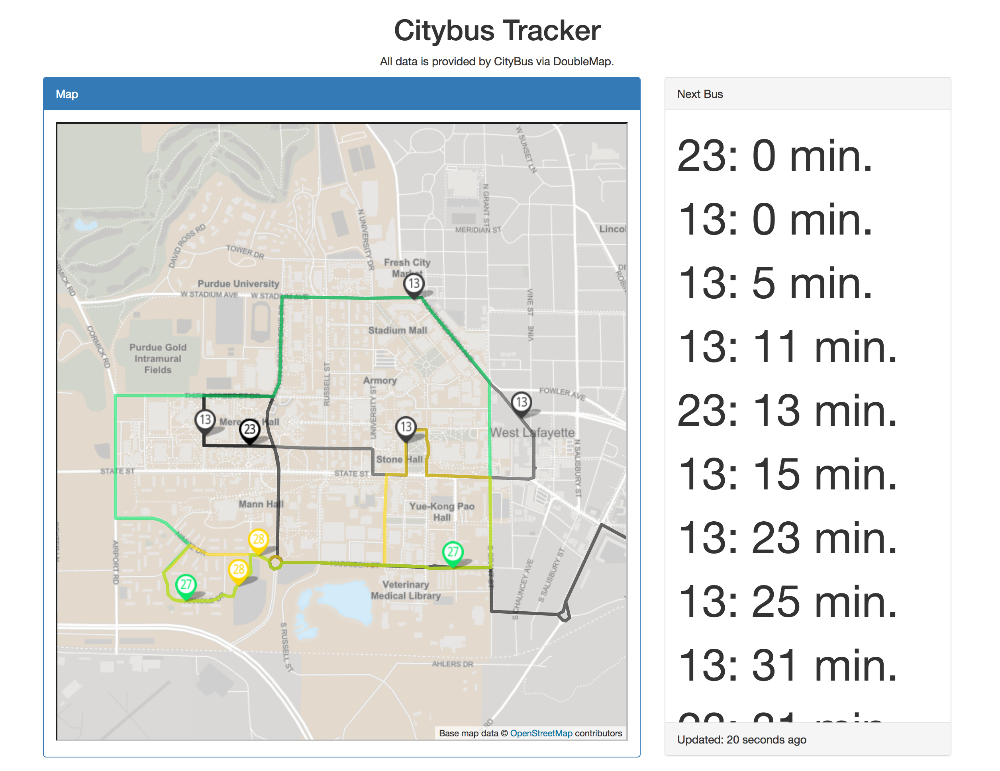

# Citybus Tracker

You choose the stops and routes you want and this will display a map showing each selected route (and each bus on said route) and a time board for selected routes/stops. All stop/route combos are merged together and sorted in order from soonest to latest departure. 

Meaning, if there are two different bus stops near your departure point, both stops contain at least one route that'll take you where you want to go, and then this application will combine those two stops/routes into one. 

# Configuration

Configure inside `config.json`. For stopIds, go [here](https://citybus.doublemap.com) and find the stopIds (in the format of `BUS<NUMBER>`) of the stops you want. Routes are the shorthand route names (for example, `13` is Silver Loop). 

# Getting it working

The DoubleMap API doesn't allow cross origin requests, but CORS is enforced client-side. So, you can disable it if you want. I recommend using Firefox with the "cors everywhere" add on.

# Data Sources

All data is provided by CityBus via DoubleMap's undocumented API. Therefore, don't use this for anything mission critical. 

# Screenshots

Below is this application with the default provided `config.json` present in this repo.

# Roadmap

* Host own server that does nothing but redirect API calls to the DoubleMap servers and sends the resulting data to the caller. Once done, this will remove the need for the end user to disable CORS.
* Allow user to change settings within the web UI (i.e. users won't need to modify the `config.json` file).
* Integrate Raspberry Pi's ability to turn on a TV via just the HDMI cord (this is called 'CEC') so that this can become an arrivals board for anyone with a TV and a Raspberry Pi. 

# License

The MIT License will apply for this `README` file, `bus.html`, `bus.js`, and `config.json*`.